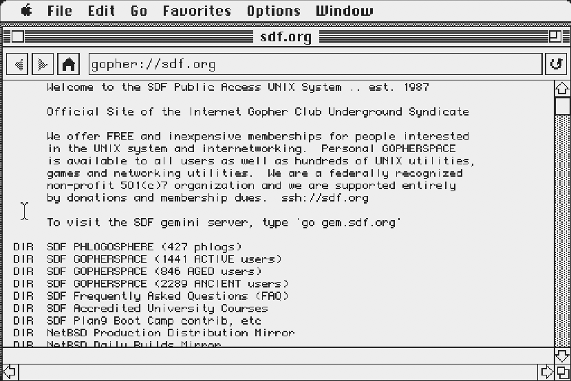
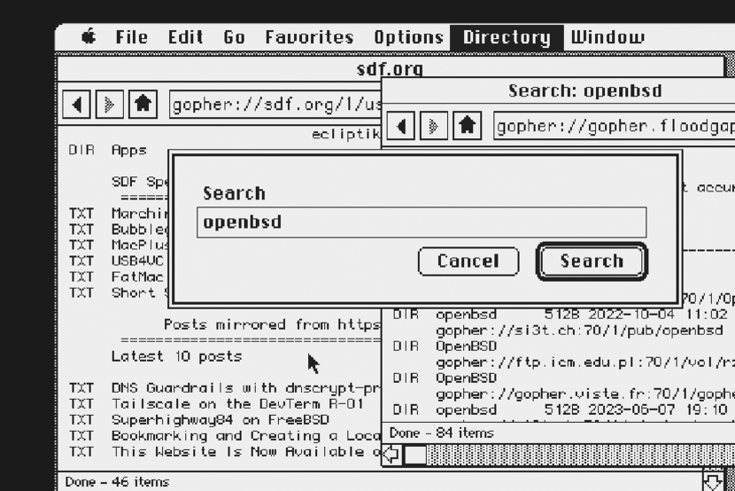
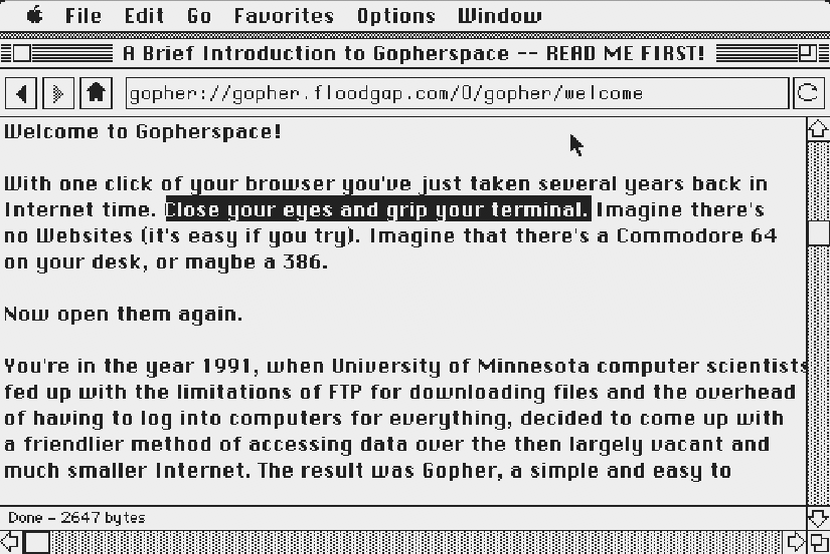
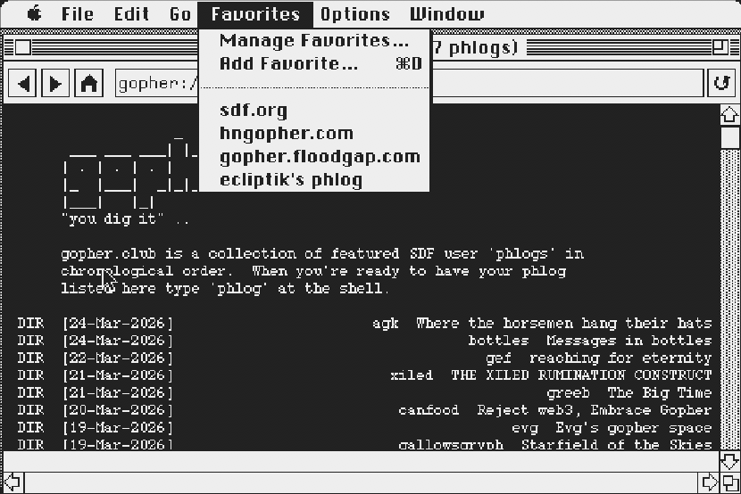

# Geomys

A [Gopher](https://en.wikipedia.org/wiki/Gopher_(protocol)) browser for classic 68000 Macintosh systems, from the Mac Plus and up. Implements [RFC 1436](https://datatracker.ietf.org/doc/html/rfc1436) and [RFC 4266](https://datatracker.ietf.org/doc/html/rfc4266) with a full Macintosh GUI. Supports monochrome on System 6 and 256 colors on System 7. Works with MacTCP. Cross-compiled on Linux using [Retro68](https://github.com/autc04/Retro68).

This project was 100% vibe coded using [Claude Code](https://docs.anthropic.com/en/docs/claude-code).

<p align="center">
<a href="#download">Download</a> · <a href="#features">Features</a> · <a href="#keyboard-shortcuts">Keyboard Shortcuts</a> · <a href="#themes">Themes</a> · <a href="#building">Building</a> · <a href="#testing">Testing</a> · <a href="#acknowledgments">Acknowledgments</a> · <a href="#license">License</a>
</p>

### System 6

| | |
|:---:|:---:|
|  |  |
| **Directory Browsing** | **Multi-Window & Search** |
|  |  |
| **Text Page & Edit Menu** | **Dark Mode & Favorites** |

---

## Download

Pre-built binaries are available on the [Releases](https://github.com/ecliptik/geomys/releases) page:

| Edition | Description | Memory | Download |
|---------|-------------|--------|----------|
| **Geomys** | Full build — 4 windows, all features including 256-color | ~1024KB | [.dsk](https://github.com/ecliptik/geomys/releases/download/v0.11.2/Geomys-0.11.2.dsk) · [.hqx](https://github.com/ecliptik/geomys/releases/download/v0.11.2/Geomys-0.11.2.hqx) |
| **Geomys Lite** | Recommended for Mac Plus — 2 windows, core features | ~505KB | [.dsk](https://github.com/ecliptik/geomys/releases/download/v0.11.2/Geomys-Lite-0.11.2.dsk) · [.hqx](https://github.com/ecliptik/geomys/releases/download/v0.11.2/Geomys-Lite-0.11.2.hqx) |
| **Geomys Minimal** | Bare-bones — 1 window, smallest binary | ~297KB | [.dsk](https://github.com/ecliptik/geomys/releases/download/v0.11.2/Geomys-Minimal-0.11.2.dsk) · [.hqx](https://github.com/ecliptik/geomys/releases/download/v0.11.2/Geomys-Minimal-0.11.2.hqx) |

Each edition is available as `.dsk` (800K floppy image) and `.hqx` (BinHex archive). No build toolchain required — just download and run. See [docs/BUILD.md](docs/BUILD.md) for custom builds.

## Requirements

- Macintosh Plus or later (4MB RAM, 68000 CPU)
- System 6.0.8 or System 7 with MacTCP
- 256-color themes require Mac II or later with Color QuickDraw

## Features

**Gopher Protocol**
- All 18 canonical and non-canonical item types
- [Gopher+](https://en.wikipedia.org/wiki/Gopher%2B) protocol support
- Binary file downloads with progress dialog
- Image save with format/dimension detection
- HTML tag-stripping renderer for type h pages
- Search queries (type 7) with dialog input

**Browsing**
- Web browser-style chrome: address bar, back/forward/home, stop/go/refresh
- Multi-window browsing (up to 4 simultaneous windows)
- Local page cache with instant back/forward navigation
- Favorites with persistent bookmarks
- Browsing history in the Go menu
- Find in Page with match highlighting

**Display**
- 9 built-in themes (Light, Dark, Solarized, Tokyo Night, Green Screen, Classic, Platinum)
- 256-color on System 7; monochrome on System 6
- 6 fonts (Monaco 9/12, Courier 10, Chicago 12, Geneva 9/10)
- Double-buffered rendering
- Horizontal and vertical scrolling

**Classic Mac Integration**
- Telnet handoff dialog for type 8/T items (launch Flynn or NCSA Telnet on System 7)
- Print support via Printing Manager
- Save Page As TeachText-readable text file
- MultiFinder, Apple Events, and Notification Manager support
- Aligned with Apple Human Interface Guidelines (1992)

## Keyboard Shortcuts

| Action | Keys | Notes |
|--------|------|-------|
| Back | Cmd+[ | Previous page |
| Forward | Cmd+] | Next page |
| Refresh | Cmd+R | Reload current page |
| Stop | Cmd+. | Cancel loading |
| Open Location | Cmd+L | Focus address bar |
| Find | Cmd+F | Search current page |
| Find Again | Cmd+G | Next match |
| New Window | Cmd+N | Open new browser window |
| Close Window | Cmd+W | Close active window |
| Save Page As | Cmd+S | Save as text file |
| Print | Cmd+P | Print current page |
| Add Favorite | Cmd+D | Bookmark current page |
| Manage Favorites | Cmd+B | Open bookmark manager |
| Copy | Cmd+C | Copy selection to clipboard |
| Undo | Cmd+Z | Undo address bar edit |
| Scroll up/down | Arrow keys | One row at a time |
| Scroll page | Page Up/Down | One page at a time |
| Top/Bottom | Home/End | Jump to start or end |
| Select link | Up/Down (content) | Navigate links with keyboard |
| Follow link | Return | Open selected link |
| Cycle focus | Tab | Switch between address bar and content |
| Quit | Cmd+Q | Quit Geomys |

## Themes

Geomys ships with 9 built-in themes selectable from Options > Theme:

| Theme | Type | Description |
|-------|------|-------------|
| [Light](src/themes/light.h) | Mono | White on black, default. Works on all systems. |
| [Dark](src/themes/dark.h) | Mono | Black on white. Works on all systems. |
| [Solarized Light](src/themes/solarized_light.h) / [Dark](src/themes/solarized_dark.h) | Color | Ethan Schoonover's Solarized palette. |
| [Tokyo Night Light](src/themes/tokyo_light.h) / [Dark](src/themes/tokyo_dark.h) | Color | Based on the Tokyo Night color scheme. |
| [Green Screen](src/themes/green_screen.h) | Color | Phosphor green on black CRT aesthetic. |
| [Classic](src/themes/classic.h) | Color | 1990s web browser colors. |
| [Platinum](src/themes/platinum.h) | Color | Mac OS 8/9 Appearance Manager inspired. |

Mono themes work on all systems including the Mac Plus. Color themes require a Mac II or later with Color QuickDraw (detected automatically at runtime).

To create custom themes or learn how the theme engine works, see the full [Theme Guide](docs/THEMES.md).

## Building

Requires the [Retro68](https://github.com/autc04/Retro68) cross-compilation toolchain. Build it from source (68k only):

```bash
git clone https://github.com/autc04/Retro68.git
cd Retro68 && git submodule update --init && cd ..
mkdir Retro68-build && cd Retro68-build
bash ../Retro68/build-toolchain.bash --no-ppc --no-carbon --prefix=$(pwd)/toolchain
```

Then build Geomys:

```bash
./scripts/build.sh
```

### Build Presets

Geomys supports fully customizable builds. Three presets cover common configurations:

| Preset | Windows | Features | Memory |
|--------|---------|----------|--------|
| `full` | 4 | everything | ~1024KB |
| `lite` | 2 | core browsing, themes, clipboard | ~505KB |
| `minimal` | 1 | bare-bones, smallest binary | ~297KB |

The default build uses the **full** preset. Select a preset with `--preset`:

```bash
./scripts/build.sh --preset minimal    # stripped, for 1MB Macs
./scripts/build.sh --preset full       # everything, 4 windows
```

Individual features can be toggled with `--feature` / `--no-feature` flags. Presets are applied first, then individual flags override:

```bash
./scripts/build.sh --preset lite --gopher-plus --styles
./scripts/build.sh --max-windows 2 --color --no-cache
```

See [docs/BUILD.md](docs/BUILD.md) for the complete list of build flags, feature details, memory costs, and examples.

## Testing

Uses [Snow](https://snowemu.com/) emulator (v1.3.1) with a Mac Plus ROM and System 6.0.8 SCSI hard drive image. Snow supports DaynaPORT SCSI/Link Ethernet emulation for MacTCP networking.

## Acknowledgments

- **[Claude Code](https://claude.ai/code)** by [Anthropic](https://www.anthropic.com/)
- **[Retro68](https://github.com/autc04/Retro68)** by Wolfgang Thaller
- **[Snow](https://snowemu.com/)** emulator
- **[wallops](https://github.com/jcs/wallops)** by joshua stein — MacTCP wrapper (`tcp.c`/`tcp.h`), DNS resolution (`dns.c`/`dns.h`), and utility functions. ISC license.
- **[subtext](https://github.com/jcs/subtext)** by joshua stein — Additional utility and networking code. ISC license.
- **[Flynn](https://github.com/ecliptik/flynn)** — Sibling Telnet client project and architectural reference. ISC license.
- **University of Illinois Board of Trustees** — TCP networking code (`tcp.c`, 1990-1992)

## License

ISC License. See [LICENSE](LICENSE) for full details.
