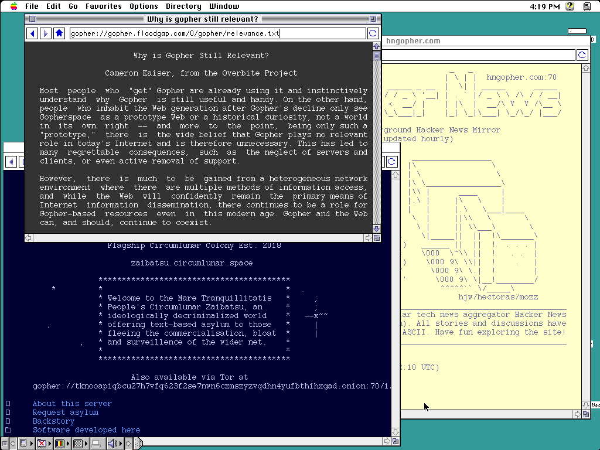

# Geomys

Geomys is a [Gopher](https://en.wikipedia.org/wiki/Gopher_(protocol)) browser for classic 68000 Macintosh computers. It supports monochrome and 256 colors, System 6 and 7, multi-window browsing, themes, favorites, Gopher+ protocol, file downloads, and keyboard navigation.

This project was 100% vibe coded using [Claude Code](https://docs.anthropic.com/en/docs/claude-code).

<p align="center">
<a href="#download">Download</a> · <a href="#features">Features</a> · <a href="#keyboard-shortcuts">Keyboard Shortcuts</a> · <a href="#themes">Themes</a> · <a href="#building">Building</a> · <a href="#testing">Testing</a> · <a href="#acknowledgments">Acknowledgments</a> · <a href="#license">License</a>
</p>

### System 6

| | |
|:---:|:---:|
|  |  |
| **Directory Browsing** | **Multi-Window & Search** |
|  |  |
| **Text Page & Edit Menu** | **Dark Mode & Favorites** |

### System 7

| |
|:---:|
|  |
| **System 7 with 256 color and multi-window** |

---

## Download

Pre-built binaries are available on the [Releases](https://codeberg.org/ecliptik/geomys/releases) page and [Macintosh Garden](https://macintoshgarden.org/apps/geomys):

| Edition | Description | Memory | Download |
|---------|-------------|--------|----------|
| **Geomys** | Full build — 3 windows, all features including 256-color | ~2560KB | [.dsk](https://codeberg.org/ecliptik/geomys/releases/download/v1.0.1/Geomys-1.0.1.dsk) · [.hqx](https://codeberg.org/ecliptik/geomys/releases/download/v1.0.1/Geomys-1.0.1.hqx) |
| **Geomys Lite** | Recommended for Mac Plus — 2 windows, core features | ~1024KB | [.dsk](https://codeberg.org/ecliptik/geomys/releases/download/v1.0.1/Geomys-Lite-1.0.1.dsk) · [.hqx](https://codeberg.org/ecliptik/geomys/releases/download/v1.0.1/Geomys-Lite-1.0.1.hqx) |
| **Geomys Minimal** | Bare-bones — 1 window, smallest binary | ~512KB | [.dsk](https://codeberg.org/ecliptik/geomys/releases/download/v1.0.1/Geomys-Minimal-1.0.1.dsk) · [.hqx](https://codeberg.org/ecliptik/geomys/releases/download/v1.0.1/Geomys-Minimal-1.0.1.hqx) |

Each edition is available as `.dsk` (800K floppy image) and `.hqx` (BinHex archive). No build toolchain required — just download and run. See [docs/BUILD.md](docs/BUILD.md) for custom builds.

## Requirements

- Macintosh Plus or later (4MB RAM, 68000 CPU)
- System 6.0.8 or System 7 with MacTCP
- 256-color themes require Mac II or later with Color QuickDraw

## Features

**Protocol**
- [RFC 1436](https://datatracker.ietf.org/doc/html/rfc1436) and [RFC 4266](https://datatracker.ietf.org/doc/html/rfc4266) — all 19 Gopher item types
- [Gopher+](https://en.wikipedia.org/wiki/Gopher%2B) — Get Info, content negotiation, search scoring, interactive forms
- Binary file downloads with progress dialog and image format detection
- HTML tag-stripping renderer, CSO/ph phonebook queries, search with dialog input
- Telnet handoff with connection dialog and app launching (System 7)

**Browsing**
- Multi-window browsing (3 windows default; increase with `--max-windows` on systems with more RAM)
- Address bar, back/forward/home, stop/go/refresh, status bar
- Local page cache for instant back/forward navigation
- 20 persistent favorites with menu quick-access
- Find in Page, browsing history, Save Page As, Print

**Display**
- 9 built-in [themes](#themes) with 256-color support on System 7 ([create your own](docs/THEMES.md))
- 8 fonts with independent size selection (9, 10, 12, 14)
- Double-buffered rendering with SICN/cicn icons
- CP437 character set and Unicode glyph rendering

**System Integration**
- Notification Manager alerts for background page loads (System 7)
- MultiFinder, Apple Events (odoc/pdoc), stationery pad support
- Optional: AppleScript and Drag Manager (available via custom build flags)
- Aligned with [Apple Human Interface Guidelines](https://archive.org/details/apple-human-interface-guidelines-1992) (1992)

## Keyboard Shortcuts

| Action | Keys | Notes |
|--------|------|-------|
| Back | Cmd+[ | Previous page |
| Forward | Cmd+] | Next page |
| Refresh | Cmd+R | Reload current page |
| Stop | Cmd+. | Cancel loading |
| Open | Cmd+L | Focus address bar |
| Find | Cmd+F | Search current page |
| Find Again | Cmd+G | Next match |
| New Window | Cmd+N | Open new browser window |
| Close Window | Cmd+W | Close active window |
| Save Page As | Cmd+S | Save as text file |
| Print | Cmd+P | Print current page |
| Add Favorite | Cmd+D | Bookmark current page |
| Manage Favorites | Cmd+B | Open bookmark manager |
| Copy | Cmd+C | Copy selection to clipboard |
| Undo | Cmd+Z | Undo address bar edit |
| Scroll up/down | Arrow keys | One row at a time |
| Scroll page | Page Up/Down | One page at a time |
| Top/Bottom | Home/End | Jump to start or end |
| Select link | Up/Down (content) | Navigate links with keyboard |
| Follow link | Return | Open selected link |
| Cycle focus | Tab | Switch between address bar and content |
| Quit | Cmd+Q | Quit Geomys |

## Themes

Geomys ships with 9 built-in themes selectable from Options > Theme:

| Theme | Type | Description |
|-------|------|-------------|
| [Light](src/themes/light.h) | Mono | White on black, default. Works on all systems. |
| [Dark](src/themes/dark.h) | Mono | Black on white. Works on all systems. |
| [Solarized Light](src/themes/solarized_light.h) / [Dark](src/themes/solarized_dark.h) | Color | Ethan Schoonover's Solarized palette. |
| [Tokyo Night Light](src/themes/tokyo_light.h) / [Dark](src/themes/tokyo_dark.h) | Color | Based on the Tokyo Night color scheme. |
| [Green Screen](src/themes/green_screen.h) | Color | Phosphor green on black CRT aesthetic. |
| [Classic](src/themes/classic.h) | Color | 1990s web browser colors. |
| [Platinum](src/themes/platinum.h) | Color | Mac OS 8/9 Appearance Manager inspired. |

Mono themes work on all systems including the Mac Plus. Color themes require a Mac II or later with Color QuickDraw (detected automatically at runtime).

To create custom themes or learn how the theme engine works, see the full [Theme Guide](docs/THEMES.md).

## Building

Requires the [Retro68](https://github.com/autc04/Retro68) cross-compilation toolchain. Build it from source (68k only):

```bash
git clone https://github.com/autc04/Retro68.git
cd Retro68 && git submodule update --init && cd ..
mkdir Retro68-build && cd Retro68-build
bash ../Retro68/build-toolchain.bash --no-ppc --no-carbon --prefix=$(pwd)/toolchain
```

Then build Geomys:

```bash
./scripts/build.sh
```

### Build Presets

Geomys supports fully customizable builds. Three presets cover common configurations:

| Preset | Windows | Features | Memory |
|--------|---------|----------|--------|
| `full` | 3 | everything | ~2560KB |
| `lite` | 2 | core browsing, themes, clipboard, HTML, telnet | ~1024KB |
| `minimal` | 1 | themes, clipboard, styles, HTML, telnet | ~512KB |

The default build uses the **full** preset. Select a preset with `--preset`:

```bash
./scripts/build.sh --preset minimal    # stripped, for 1MB Macs
./scripts/build.sh --preset full       # everything, 3 windows
```

Individual features can be toggled with `--feature` / `--no-feature` flags. Presets are applied first, then individual flags override:

```bash
./scripts/build.sh --preset lite --gopher-plus --styles
./scripts/build.sh --max-windows 2 --color --no-cache
```

See [docs/BUILD.md](docs/BUILD.md) for the complete list of build flags, feature details, memory costs, and examples.

### Memory and Multi-Window

On System 7 with MultiFinder, Geomys requests a memory partition via the SIZE resource. Default allocations:

| Preset | Preferred | Minimum |
|--------|-----------|---------|
| Full | 2560KB | 1536KB |
| Lite | 1024KB | 768KB |
| Minimal | 512KB | 256KB |

Large Gopher directories (1000+ items) use significant memory (~300KB per directory). With multiple windows open, the second and third windows may show fewer items if heap space runs low. This is normal on a 4MB Mac.

**To increase memory on machines with more RAM**: select the Geomys application in Finder, choose File > Get Info, and increase the "Application Memory Size" field. No rebuild required.

## Testing

- **System 6 (monochrome)**: [Snow](https://snowemu.com/) emulator (v1.3.1) with Mac Plus ROM and System 6.0.8 SCSI hard drive image. DaynaPORT SCSI/Link Ethernet emulation for MacTCP networking.
- **System 7 (color)**: [Basilisk II](https://basilisk.cebix.net/) emulator with Macintosh IIci ROM and System 7.6.1. Color QuickDraw support for 256-color themes and multi-window testing.

## Acknowledgments

- **[Claude Code](https://claude.ai/code)** by [Anthropic](https://www.anthropic.com/)
- **[Retro68](https://github.com/autc04/Retro68)** by Wolfgang Thaller
- **[Snow](https://snowemu.com/)** emulator
- **[wallops](https://github.com/jcs/wallops)** by joshua stein — MacTCP wrapper (`tcp.c`/`tcp.h`), DNS resolution (`dns.c`/`dns.h`), and utility functions. ISC license.
- **[subtext](https://github.com/jcs/subtext)** by joshua stein — Additional utility and networking code. ISC license.
- **[Flynn](https://codeberg.org/ecliptik/flynn)** — Sibling Telnet client project and architectural reference. ISC license.
- **University of Illinois Board of Trustees** — TCP networking code (`tcp.c`, 1990-1992)

## License

ISC License. See [LICENSE](LICENSE) for full details.

---

> **Note:** The [GitHub repository](https://github.com/ecliptik/geomys) is a read-only mirror. Please open issues and pull requests on [Codeberg](https://codeberg.org/ecliptik/geomys).
